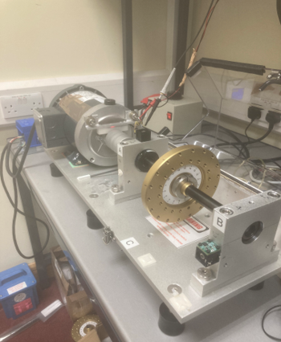
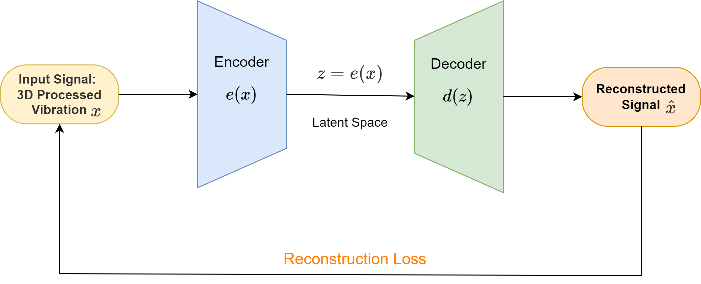
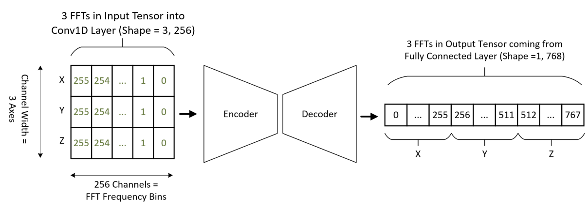

# Motor Fault Detection at the Edge using MAX78000

## A Case Study with the SampleMotorDataLimerick Dataset

## Overview

Condition-based monitoring (CbM) is the automated monitoring of equipment conditions. This process includes collecting sensor data and applying algorithms or machine learning techniques to predict the health status of the equipment. The equipment of interest is usually motors used in many industrial applications.

The fact that the unhealthy, a.k.a. faulty data types, are hard to collect with varying types of operations leads to the use of “unsupervised” CbM models. Hence, only healthy data are used for model training and several fault types are tested for detection performance.

The following sections will present the fault detection system for the edge devices. The designed model is trained, deployed, and verified on MAX78000 EVkit. Model performance is verified and evaluated using in-house sample motor data available from [https://github.com/analogdevicesinc/CbM-Datasets](https://github.com/analogdevicesinc/CbM-Datasets).

## Dataset Information

### Raw Data Properties

Sample motor data is collected using a SpectraQuest Machinery Fault Simulator. The setup looks as follows:

Faults tested include a variety of mechanical faults as follows:

- Very Light Imbalance
- Light Imbalance
- Heavy Imbalance
- Very Heavy Imbalance
- Bent Shaft
- Misaligned Shaft (Angular)
- Light Inner Race Fault
- Heavy Inner Race Fault
- Light Outer Race Fault
- Heavy Outer Race Fault
- Light Ball Bearing Fault
- Heavy Ball Bearing Fault

For imbalance faults, varying loads are applied in the setup, a sample can be seen here:

Details for other fault types:

Each fault was tested at 600, 1200, 1800, 2400 & 3000 RPM and tested both with and without an additional 11 lb (5 kg) load on the shaft. ADXL356 sensor data is used for vibration raw data.

For ADXL356 sensor, the sampling frequency was **20 kHz** and data csv files recorded for **2 seconds** in the X, Y and Z directions.

Data files are saved in `.csv` format with the following naming convention:

### Data Loader Design

The data loader handles all the data related tasks for proper model training such as raw data pre-processing, windowing, type casting etc.

The signal pre-processing flow starts with a windowing of continuous signal using 0.25 seconds long segments with overlapping approach (with a 0.75 ratio set) for each raw data csv file including 2 seconds of vibration data.

The data loader implementation is in the [training repository](https://github.com/MaximIntegratedAI/ai8x-training/), (`datasets/samplemotordatalimerick.py`). Its functionality is described in the following sections.

#### Data Pre-processing

Data pre-processing steps include downsampling of the signal, windowing, FFT operation and scaling.

##### Downsampling

The raw data sampling rate is 20 kHz and the initial pre-processing step is downsampling with a factor of 10 providing a 2 kHz sampling rate for later processing.

##### FFT

As both the fault effects and the rotation characteristics are more visible in the frequency domain, the windowed signals are then input into an FFT. Power normalization inside the window, for each frequency bin is also applied.

##### Scaling

All samples are scaled on a per-sample, per-axis basis such that each of the X, Y & Z FFTs all have the same minimum and maximum value, even if the magnitude of all the FFTs prior to scaling is quite different. This is done so that the contribution to the reconstruction error from each axis has the chance to be equal. Per-instance and per-axis scaling gives all samples, and all axes within the sample, equal importance.

#### Train – Test Set Distributions

The data loader also handles the train-test data splitting operations. In an unsupervised learning approach, the training set only includes healthy samples without any fault conditions. 20% of the healthy data is also kept for the validation set and contributes to the testset as well. The testset includes all kinds of fault conditions.

#### Label Modes

For autoencoder model training, the data samples will have a label equivalent to the input signal since an MSE loss will be used and the aim of the model is to reconstruct the input as closely as possible. For the evaluation mode where anomaly detection performance is of interest, each data sample will have a binary label representing whether the raw data session is a healthy case or includes any faults.

## Model Structure and Training

### Model Structure

The neural network architecture is called an autoencoder. Autoencoders learn to reconstruct their input at their output. The autoencoder is trained so that the maximum information is kept after dimension reduction through encoding and has the minimum reconstruction loss (RL) after decoding. Therefore, the encoder and decoder structures are forced to learn the best encoding-decoding scheme in the training process. Autoencoders are well suited to an unsupervised learning approach using the healthy signal reconstruction and provide a high RL when a fault case is encountered that deviates from healthy data.

The model implementation file is in the [training repository](https://github.com/MaximIntegratedAI/ai8x-training/), (`models/ai85net-autoencoder.py`).

The input to the autoencoder is a 2D tensor of shape (256, 3). There are 256 channels each of width 3. Therefore, each channel contains one frequency bin value from each of the vibrational axes. CNN filters work depthwise across channels, so at the input layer, each filter is looking at a single axis at a time. These axes are combined internally in the model. The output data format is a 1D tensor of length 768 (3 axes × 256 frequency bins). The reason is that the output layer is a fully connected layer, not a convolutional layer.

The use of a fully connected layer for the output layer (and several internal hidden layers) is to accommodate the fact that 1D transpose convolutions are not yet available in the target software stack. Transpose convolutions are generally used in the decoder to reconstruct the compressed representation of the data that the decoder received. Convolutional layers are used in the encoder to reduce the number of total parameters in the model.

Notations:

- I = Number of input channels
- O = Number of output channels
- K = Width of kernel (AKA filter)
- Wout = Width of output channels
- A = Activation function

Key for fully connected layers:

- I = Number of input neurons
- O = Number of output neurons
- A = Activation function

The model training script is also available in the [training repository](https://github.com/MaximIntegratedAI/ai8x-training/), (`scripts/train_autoencoder.sh`).

### Trained Model Evaluation Notebook

The trained autoencoder model will generate an output with the input signal shape, and is trained to reconstruct the healthy signal as closely as possible. A small post-processing step is required to deploy the model in the fault detection system:. The system should mark some inputs as anomalies using the model output.

The basic principle of this post-processing step is to use the reconstruction loss (RL) level to detect any fault. Therefore, a pre-determined, learned threshold is needed for the decision boundary. Using training samples' RL percentiles is practical and a sample evaluation script is also available in [training repository](https://github.com/MaximIntegratedAI/ai8x-training/), (`notebooks/AutoEncoder_Evaluation.ipynb`) and demonstrates these post-processing and performance evaluation steps.

Several performance metrics such as balanced accuracy (average of True Positive Rate and True Negative Rate) and False Positive Rate, F1 score, etc. are evaluated in this notebook. Some evaluation plots for the SampleMotorDataLimerick dataset are:

## Model Implementation – Synthesis

The file located at [synthesis repository](https://github.com/MaximIntegratedAI/ai8x-synthesis/), (`networks/ai85-autoencoder.yaml`)  describes to the ai8x synthesizer how the layers of the neural network should be mapped into the MAX78000 hardware.

A known answer test (KAT) is also performed on the MAX78000 EVKit. The C code for this KAT can be generated using the `scripts/gen_autoencoder_max78000.sh` script in the [synthesis repository](https://github.com/MaximIntegratedAI/ai8x-synthesis/).
