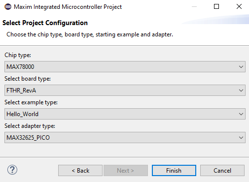
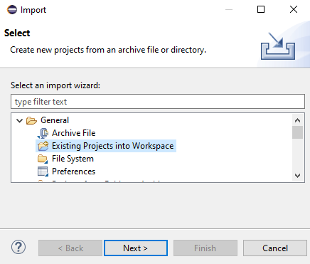
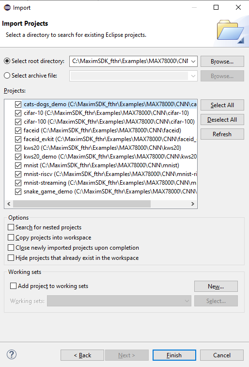
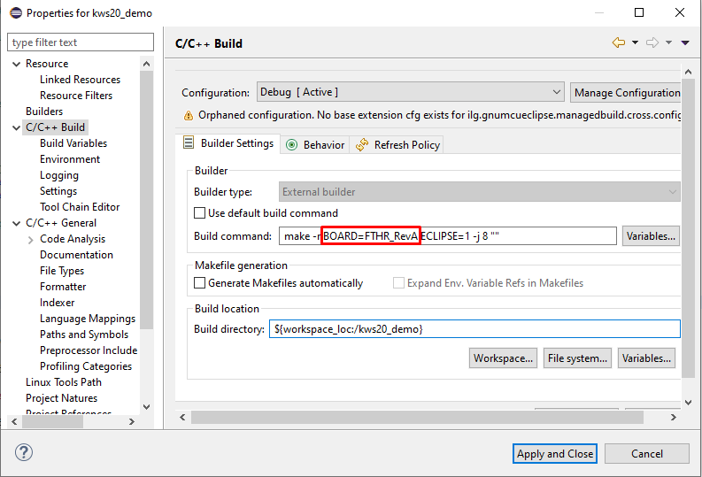
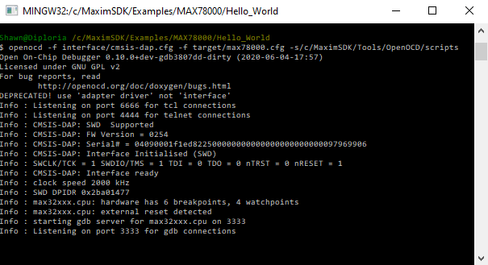
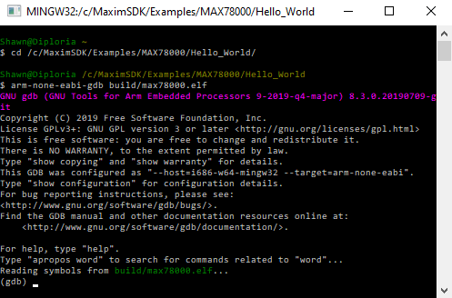

# Getting Started with the MAX78000FTHR


## Schematic
The schematic and BOM can be found in the MAX78000FTHR Datasheet.  See https://www.maximintegrated.com/en/products/microcontrollers/MAX78000FTHR.html

## Developing with Eclipse

This is the quickest way to evaluate pre-trained and sythesized ML demonstrations.  You'll need to download and install the Maxim SDK onto a Windows 10 host.  The Maxim SDK is available here:

https://www.maximintegrated.com/content/maximintegrated/en/design/software-description.html/swpart=SFW0010820A

### Creating a I/O Peripheral Project

The SDK contains example projects for all integrated peripherals, such as I2C, GPIO, and UART.  These can be used as a template for your own projects. To do this select "New"->"Maxim Microcontrollers" within clipse as demonstrated below.


Enter a name for your project and click 'Next'.

The 'Select Project Configuration' dialog can be configure as follows:



The 'Select example type' can be any firmware example you are intrested in.  Note that the CNN-specific examples are not listed here.  CNN examples must be imported via a different mechansim explained below.

If you are using the PICO debugger, set the adapter type to MAX32625_PICO.  If you are using the Olimix debugger, set the adapter type to CMSIS-DAP.

Click 'Finish' and Eclipse will open your project and you may edit, compile, and debug.

### Creating a CNN Project from an Example

If you are intrested in the CNN examples, you can use "File->Import" within Eclipse to import them into your workspace. When prompted, select 'Existing Projects into Workspace'



You need to provide the path to the CNN examples within the SDK tree similar to the image below.  The path will depend on where you installed the SDK.



The Maxim SDK comes with many convolutional nerual network demonstrations which can be imported into Eclipse.  These firmware examples can be found within the SDK in Examples\MAX78000\CNN.  Choose "File"->"Import" and then select "General->Existing Projects into Workspace".  Using the subsequent dialogs, navigate to Examples\MAX78000\CNN and import all firmware projects that you are interested in.  You'll find peripheral-oriented examples for the MAX78000 in the Examples\MAX78000 directory.

All CNN examples will run on the MAX78000EVKIT, but not all a currently supported on the MAX78000FTHR.  Here's a list of examples that are supported on the MAX78000FTHR:

* cifar-10
* cifar-100
* mnist
* mnist-riscv
* mnist-streaming
* kws20
* kws20_demo

Note that all examples are targted at the EVKIT by default.  To change the target to the FTHR, you must pass BOARD=FTHR_RevA to make.  This can be accomplished within Eclipse on a per-project basis as follows:



The Firmware-Focused Approach allows you to quickly compile, modify, and debug existing CNN examples, but if you want to modify the ML models or re-train the ML network, you will need to use the ML-focused approach described in the next section.

## Building the SDK Examples using MINGW on Windows

The SDK includes multiple examples to demonstrate the features of the MAX78000 and to show the use of the various functions available in the API. Each example includes a makefile that has been configured to work with the EV Kit. To build an example, simply change to the directory containing the example and run "make". When built, each example results in a max78000.elf (or max78000-combined.elf for projects involving both the RISC-V and ARM cores) file that can be found in the "build" directory of that example.

On Windows, the MSYS shell (included in the SDK) can be used to build examples.  Start 'msys.bat' to launch the shell.  The shell can be accessed from the Windows Start Menu or in the default installation directory show below.


Below is an example of how to build the "hello world" example.  Other tools, such as openocd and gdb can be accessed from the MinGW shell.


## Loading and Running Example Firmware

Applications are loaded, debugged, and run using OpenOCD and GDB.  This section shows how to do this specifically with MSYS on Windows, but very similar methods can be used under Linux.  In fact, if you prefer to develop using Linux, see the section [Installing the Developer Tools \(Linux\)](# Installing the Developer Tools (Linux)) below.

The MAX78000FTHR has an integrated daplink debuggger. 

1.  Connect the FTHR to your host PC with a USB cable.  Windows will enumerate a daplink device and-thumb drive device.

2.  Change to the OpenOCD directory and launch OpenOCD with the following command:

    ```
    openocd -f interface/cmsis-dap.cfg -f target/max78000.cfg -s/c/MaximSDK/Tools/OpenOCD/scripts
    ```

3.  On successful connection, you will see messages as shown below.



4.  From another command prompt, change to the directory containing the application you would like to load.



5.  Launch GDB using one of the following commands:

    ```
    arm-none-eabi-gdb max78000.elf
    arm-none-eabi-gdb max78000-combined.elf
    ```

6.  Connect GDB to OpenOCD and reset the MAX78000.

    ```
    target remote localhost:3333
    monitor reset halt
    ```

7.  Load and verify the application.

    ```
    load
    compare-sections
    ```

8.  Reset the device and run the application:

    ```
    monitor reset halt
    c
    ```


## Debugging Applications with GDB

Follow the same steps provided in the *Loading and Running Applications on the EV Kit* section. While the application is running, use \<CTRL-C\> to interrupt the application and halt its execution. The table below lists a few of the commands available to you any time the application is halted.

| **Command**                    | **Short Command** | **Description**                                              |
| ------------------------------ | ----------------- | ------------------------------------------------------------ |
| monitor halt                   |                   | Halt the microcontroller.                                    |
| monitor reset halt             |                   | Reset the microcontroller and immediately halt.              |
| monitor max32xxx mass\_erase 0 |                   | Mass erase the flash.                                        |
| continue                       | c                 | Continue execution.                                          |
| break \<arg\>                  | b \<arg\>         | Set a breakpoint. Argument can be function\_name, file:line\_number, or \*address. |
| print \<variable\>             | p                 | Print the value of a variable. Variable must be in current scope. |
| backtrace                      | bt                | Print contents of the stack frame.                           |
| step                           | s                 | Execute the next instruction.                                |
| next                           | n                 | Execute the next line of code.                               |
| finish                         | f                 | Continue to the end of the current function.                 |
| info reg                       |                   | Print the values of the ARM registers.                       |
| help                           |                   | Print descriptions for available commands                    |
| help \<cmd\>                   |                   | Print description for given command.                         |

## Additional SDK Information

The examples are separated by device type. The SDK on GitHub currently only includes the MAX78000. Therefore, the examples will be located in the Examples/MAX78000 folder. For each example, you will find the following files.

-   makefile -- This file contains the rules used to build the application with the "make" command. The binaries for each project can be removed with the "make clean" command. Use "make distclean" to remove the binaries for each project and any libraries the project depends on.

-   main.c -- This source file contains the entry point for the application.

-   \*.c -- These files contain additional source code required by the example if necessary. Many of the examples reside entirely in the main.c file and will not have additional .c files.

-   \*.launch, .cproject, and .project -- These files are the project files used in the Eclipse environment. They can be ignored when working with OpenOCD and GDB from the command line. (Note a few examples do not have Eclipse project files yet.)  For more information on using Eclipse, see ["Getting Started with Eclipse"](https://pdfserv.maximintegrated.com/en/an/TUT6245.pdf)

The SDK provides an API for working with the device's components. To use the API, you will need to include the header (\*.h) files in your source code. The API header files for the MAX78000 reside in Libraries/PeriphDrivers/Include/MAX78000/. For convenience, you can include the "mxc.h" file in your source. This file includes the headers for all the supported peripheral libraries. Documentation for the functions contained in the API can be found at Libraries/PeriphDrivers/Documentation/MAX78000/index.html.

## ML-Focused Approach using Linux

This approach allows the user to train and sythesize convolutional neural networks using Pytorch and TensorFlow.  Additionaly, compilation and debugging is supported under Linux making this method peferable for most developers that do not require Eclipse and are comfortable using bash, openOCD, and GDB directly.  Additionally, augmented ML toolchains, MAX78000-specific sythesis tools and supporting software are made available via github.

Two github repositories are required:  

https://github.com/MaximIntegratedAI/ai8x-training

https://github.com/MaximIntegratedAI/ai8x-synthesis

Refer to the readme found in each repository for details on how to configure your Linux host.

Additional repositories of intrest include documentation and early-release versions of the Maxim SDK:

https://github.com/MaximIntegratedAI/MaximAI_Documentation

https://github.com/MaximIntegratedAI/MAX78000_SDK

## Installing the Developer Tools (Linux)

In addition to Windows+Eclipse, you can compile, flash, and debug firmware under Linux:

-   The GNU Tools for ARM Embedded Processors

    1.  Browse to <https://developer.arm.com/tools-and-software/open-source-software/developer-tools/gnu-toolchain/gnu-rm/downloads> and download and extract the gcc-arm-none-eabi-9-2019-q4-major package that corresponds to your system.

    2.  Edit your PATH variable to include the path to the arm-none-eabi directory.

-   The MAX78000 SDK

    1.  The SDK is hosted on GitHub and is a submodule of the ai8x-sythesis repository. To get the SDK and all the additional supporting files, clone the ai8x-sythesis repository (including submodules) found at https://github.com/MaximIntegratedAI/ai8x-synthesis.

-   OpenOCD

    1.  Maxim provides pre-built binaries for the Ubuntu 18.04 LTS distribution. These should automatically be installed along with the SDK above.  However, if not, the binaries can be downloaded from [here](https://github.com/MaximIntegratedAI/MAX78000_SDK/tree/master/Tools/OpenOCD).

    2.  You also have the option of building OpenOCD from source. Visit <https://github.com/MaximIntegratedMicros/openocd> and follow the instructions in the README found there.


## Next Steps:  Loading and running the included **mnist** CNN example

Now that proper operation of the MAX78000FTHR has been established by running a simple demo and observing the expected LED and console output, the next step is to run the included 'Hello World' of CNNs, the **mnist** example.  

### CNN Boost
The MAX78000FTHR features an external boost circuit that can be used to supply the CNN when under high computational load.  The boost circuit is enabled by  supplying the `--boost 2.5` command line argument to ai8xizer.

The internal SIMO can be used to power the CNN under moderate computational loads, however, the external boot circuit is recommended during development to avoid SIMO brown-out due to transient over-current conditions which can cause the CNN to fail.

### Links to mnist and additional CNN examples
  * [mnist CNN example](https://github.com/MaximIntegratedAI/MAX78000_SDK/tree/master/Examples/MAX78000/CNN/mnist)
  * [Directory of additional CNN examples](https://github.com/MaximIntegratedAI/MAX78000_SDK/tree/master/Examples/MAX78000/CNN)

## Going beyond the included CNN examples - Advanced Topics
  * [AI8X Model Training and Quantization](https://github.com/MaximIntegratedAI/ai8x-synthesis/blob/master/README.md)
  * [AI8X Network Loader and RTL Simulation Generator](https://github.com/MaximIntegratedAI/ai8x-synthesis/blob/master/README.md)

